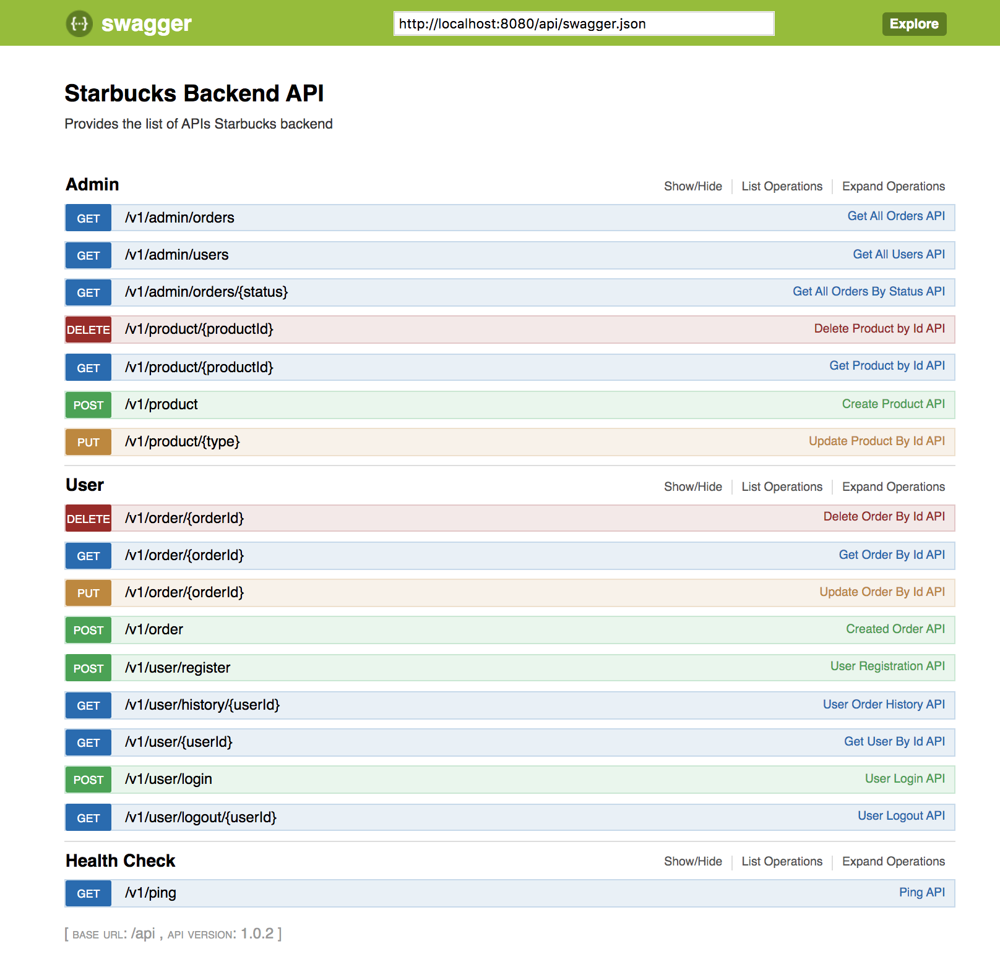
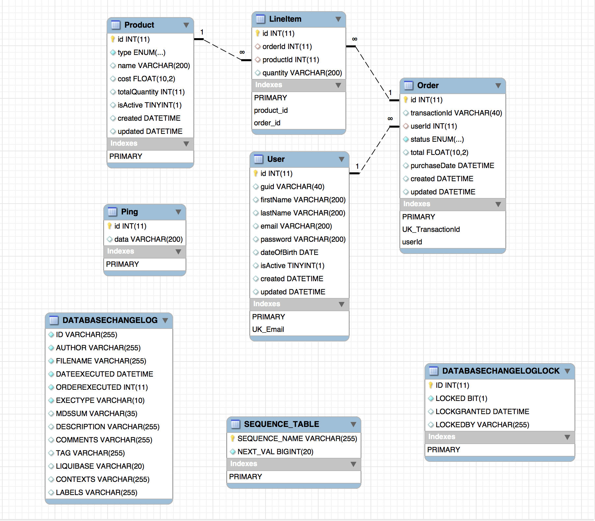

# Starbucks-Backend
>This repository provides a sample backend code for creating a coffee ordering REST application like Starbucks. 

------------------------------------------------------------------------------------------------------------------
### Pre-requisites:
* Java-8
* mysql 5.7 & above
* IntelliJ IDE (Optional)

### How to Compile:
* Go to the parent project directory `cd starbucks-backend`
* Run `mvn clean install`

### How to Run:
* Go to API directory `cd /starbucks-backend/api`
* Run `mvn jetty:run` 

### How to Tets:
* Go to parent project directory `cd /starbucks-backend`
* Run `mvn clean test` 

### Database Setup:
* Install MySql on your local
* Create a database with name `starbucks`
* Go to the directory `starbucks-backend/common/src/main/resources`
* Change the following parameters in the `config.json` file
    * `"username": "Your Username Here"`
    * `"access": "Your Password Here"`
    
    
### List of available API:

### Database Schema: 

### How to generate Swagger documentation:
* Run the project
* Install the chrome plugin : https://bit.ly/2wIiKOw
* Go to the url : http://localhost:8080/api/swagger.json
* Click on the plugin icon in the browser  

